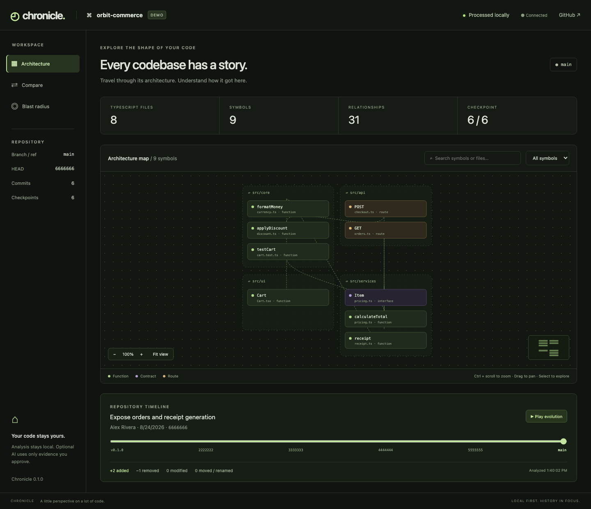
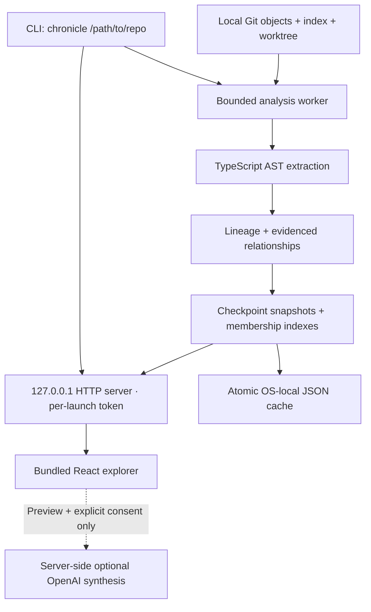

# Chronicle

## Your code, through time.

A local-first developer tool that turns Git history into an explorable map of a TypeScript codebase. Follow declarations through refactors, compare repository states, and investigate the likely impact of a change—without uploading the checkout.

Built by [Pranav Seelam](https://pseelam.com). **MIT licensed · TypeScript / TSX · Node.js 22+ · npm publication pending.**

[Engineering case study](https://pseelam.com/projects/chronicle/) · [Architecture](docs/ARCHITECTURE.md) · [Privacy & threat model](docs/PRIVACY.md) · [Validation](docs/VALIDATION.md) · [CLI reference](docs/CLI.md)



_The real installed application, analyzing bundled synthetic history. This is a product screenshot, not a design mockup or private customer repository._

## Start locally

The source is public. The npm package is **not published yet**; use the checkout today:

```sh
git clone https://github.com/pseelam02/chronicle.git
cd chronicle
npm ci
npm run build
node dist/cli.js --demo
# Or analyze your own checkout, with all external AI disabled:
node dist/cli.js /path/to/repository --no-ai
```

Chronicle opens your browser and shows real analysis progress. Keep the terminal running; press **Ctrl+C** to shut down. Git must be on PATH. No account, database server, Docker, or API key is needed for the deterministic experience. Analyzed repositories are never installed or executed.

## Read the engineering story

- [From a diff to a decision.](#problem)
- [One package. One local trust boundary.](#architecture)
- [Inspect the past. Leave the checkout alone.](#history)
- [A rename is not necessarily a new function.](#lineage)
- [Relationships need a time dimension.](#graph)
- [Localhost is a boundary to defend.](#security)
- [Algorithms establish the record. AI may summarize it.](#ai)
- [Test the artifact people install.](#validation)
- [A browser interface. A terminal lifecycle.](#usage)
- [The next step is better answers, not more spectacle.](#tradeoffs)

<a id="problem"></a>

## From a diff to a decision.

A diff tells you what changed. It does not, by itself, show how a function moved between modules, which contracts depend on it, or which historical changes deserve attention before a refactor. Those answers are scattered across the editor, commit log, and dependency structure.

Chronicle brings those views together. A developer can select calculateTotal, inspect its callers, follow a possible earlier name, compare a historical snapshot with today’s working tree, and read the relevant Git evidence. The goal is to shorten an investigation—not replace Git or claim to understand undocumented intent.

This is an engineering project with an implemented and tested v0.1. It is not a claim of product-market fit, measured productivity gains, or production adoption. Its value still needs to be demonstrated in real developer workflows.

<a id="architecture"></a>

## One package. One local trust boundary.

The CLI is the application’s server and data layer. It starts a Node HTTP server on 127.0.0.1, opens the browser, and moves analysis into worker threads. The main process remains available for progress, API requests, refreshes, and termination while the worker inspects history.

The browser receives a serializable graph rather than access to Git or the filesystem. A shared model keeps the real analyzer, precomputed demo, cache, and UI aligned. Actual analysis stages and counts stream over authenticated server-sent events; there are no simulated progress timers.

esbuild produces the executable, worker, and browser assets. React is bundled; TypeScript and the optional OpenAI SDK are JavaScript runtime dependencies. JSON persistence avoids native compilation and a database daemon. There is no hosted Chronicle backend, Docker requirement, or target-repository dependency installation.



| Source area         | Responsibility                                                                                                                              |
| ------------------- | ------------------------------------------------------------------------------------------------------------------------------------------- |
| `packages/cli`      | Arguments, loopback HTTP, authenticated APIs, worker lifecycle, browser launch, graceful shutdown, and consent-gated synthesis.             |
| `packages/analyzer` | Read-only Git inspection, AST extraction, checkpoint selection, lineage matching, comparisons, historical evidence, and cache management.   |
| `packages/shared`   | Serializable file, symbol, edge, checkpoint, and progress types. One data model connects workers, persistence, demo data, and the browser.  |
| `packages/web`      | Architecture map, timeline, comparisons, symbol inspector, evidence viewer, and impact analysis. Prebuilt assets, not a development server. |

### Analysis pipeline

1. **Resolve.** Canonicalize the Git root and resolve the selected ref to an immutable commit.
2. **Sample.** Read local history; prioritize boundary commits, tags, merges, and evenly spaced checkpoints.
3. **Parse.** Read Git blobs without checkout; reuse unchanged path/blob AST results within the run.
4. **Connect.** Resolve supported relationships, match lineage, and index checkpoint membership.
5. **Explore.** Cache the result and serve the graph, evidence, staged state, and working-tree comparisons.

<a id="history"></a>

## Inspect the past. Leave the checkout alone.

Historical source is read with Git object inspection: ls-tree enumerates files and cat-file retrieves blobs. No historical commit is checked out. Separate snapshots represent the index and the working tree, including relevant untracked TypeScript files. Staged lineage is anchored to HEAD, not whichever branch snapshot happened to be analyzed last.

Parsing every file at every commit would make cost grow with both history length and repository size. Chronicle instead samples 12 historical checkpoints by default, configurable from 2 to 50, prioritizing endpoints, tags, merges, and even spacing. Branch and tag tips and merge bases are available within limits; a discovered unsampled commit can be analyzed on demand in a bounded worker.

Within a run, unchanged path/blob pairs reuse their parsed AST results. Across launches, complete analysis indexes are keyed by canonical repository identity, HEAD, refs, index and dirty-file state, analyzer/schema and language versions, selected ref, and configuration. Atomic writes prevent a partially written index from becoming a valid cache entry; corrupt entries are rebuilt.

The tradeoff is explicit: sampled history can miss an intermediate introduction or short-lived symbol. The UI says “first observed” rather than claiming an exact introduction. Persistent per-blob reuse and exact historical lookup are future work, not current capabilities.

<a id="lineage"></a>

## A rename is not necessarily a new function.

The TypeScript Compiler API extracts declarations, source spans, signatures, exports, and supported relationships from TS and TSX. Each symbol has both a normalized structural fingerprint and a separate exact declaration hash. Structure helps identify a symbol across a rename; the exact hash still detects implementation edits, including identifier-only changes.

Lineage matching proceeds conservatively: first the same file and qualified declaration, then Git file-rename evidence with the same qualified name, then a unique normalized AST fingerprint of the same declaration kind. A successful match reuses the Chronicle ID and remaps relationship endpoints.

Confidence is a rule-based indicator, not a calibrated probability. Git-assisted moves receive 0.95 and unique structural matches 0.85; confidence cannot exceed an earlier uncertain link. Ambiguous shared structure becomes a low-confidence split/merge candidate at 0.45, rather than silently collapsing different symbols into one identity.

A concrete example in the synthetic demo moves pricing logic to another directory and later renames the total function. The explorer can connect those observations while retaining their evidence. A simultaneous rewrite and move, duplicate structure, overloads, or complex branch history can remain unresolved. Exposing that uncertainty is part of the data model, not just a disclaimer.

<a id="graph"></a>

## Relationships need a time dimension.

A checkpoint contains a commit, files, symbols, and evidenced edges. Membership indexes map symbol IDs and relationship IDs to the checkpoints in which they exist. Snapshots reconstruct architecture directly; comparisons use stable IDs and exact hashes to identify additions, removals, moves, modifications, and edge changes. A specialized graph database is unnecessary for this bounded local workload.

Relationships include defines, exports, relative imports, recognizable test imports, syntactic calls, type dependencies, extends, and implements. Each carries evidence and confidence. This is not a fully type-checked semantic program: tsconfig aliases, lexical shadowing, dynamic dispatch, and non-TypeScript consumers limit coverage.

Impact analysis seeds the graph with changed declarations and changed file hashes, follows reverse relationships, and conservatively includes declarations in affected files. The inspector explains each inclusion and surfaces routes, contracts, test relationships, connected symbols, and sampled co-change patterns. “No inferred test” means the graph found none—not that a repository has no tests.

The grouped 2D explorer favors readable architecture over a decorative force graph. Search, kind filters, zoom, pan, fit-to-view, and a minimap manage context. Rendering is capped at 100 matching nodes and 100 visible symbol edges; large-graph virtualization remains a next step.

<a id="security"></a>

## Localhost is a boundary to defend.

Local-first does not mean a local HTTP server is automatically safe. Each launch creates a random 256-bit session token. The browser receives it in a URL fragment, removes it from the address bar, retains it in tab-scoped session storage, and authenticates API calls with a Bearer header. Exact Host and Origin checks, cross-site request checks, CSP, no-store, and no-referrer headers reinforce the boundary.

The API accepts only the opened repository and discovered commits or checkpoints. It does not expose arbitrary files, paths, or Git commands. Git runs with argument arrays, not shell interpolation. Optional locks, hooks, fsmonitor, external diff, textconv, and lazy fetching are disabled for analysis operations; canonical worktree containment and symlink checks constrain file reads.

Resource limits are deliberate: 2,000 history commits, 1,500 TypeScript files per snapshot, 1 MB per file, a 768 MB worker heap, and bounded Git output, diff output, streams, and background jobs. Oversized or unsupported inputs produce coverage notes. Ctrl+C terminates workers, closes streams and sockets, and stops the server.

Caches live outside the checkout and contain private metadata, signatures, and relationships. Owner permissions are used where supported; Windows inherits account ACLs. There is no additional encryption at rest. Chronicle is not an OS sandbox against another process running as the same user, a malicious extension, a compromised Git binary, or concurrent filesystem races.

<a id="ai"></a>

## Algorithms establish the record. AI may summarize it.

The map, timeline, lineage, comparisons, impact analysis, and basic historical explanations work offline without a model or key. Deterministic explanations link checkpoint observations, names, paths, changes, and commit messages to supporting evidence. They distinguish direct Git evidence, static inference, and heuristic lineage.

Optional synthesis requires a server-side key and an explicit UI consent action after an exact evidence preview. At most eight bounded historical evidence records are sent—not source bodies, full diffs, remote URLs, or the whole repository. The preview and request use the same server-side selection function, avoiding a mismatch between what the user approved and what is transmitted.

The official OpenAI SDK requests a structured response with evidence citations, bounded output, one retry, a 15-second SDK timeout, and a 20-second overall abort. Invalid citation IDs are rejected or omitted and raw SDK errors are redacted. Citation validity is not proof that an interpretation is true. --no-ai disables the entire provider path even when a key is present.

<a id="validation"></a>

## Test the artifact people install.

The recorded v0.1 validation on September 5, 2026 passed 26 unit, integration, security, and runtime tests, plus two Chromium end-to-end scenario suites. Formatting, linting, strict type checking, production builds, and secret scans passed. Runtime CI covered Node 22 and 24 on macOS, Ubuntu, and Windows; browser and packaging checks ran separately on Linux.

Packaging verification built the production artifacts, ran npm pack, installed the tarball in a fresh temporary directory with lifecycle scripts disabled and isolated npm configuration, and launched the installed executable from that installation. Browser flows covered the offline demo and generated private checkout, including timeline, comparisons, evidence, impact, refresh, and shutdown. This checks that success does not depend on the source workspace.

Controlled Git fixtures exercise modifications, file moves, symbol renames, staged changes, and untracked files. A larger fixture with 180 additional modules exercised genuine progress, rendering limits, and search. Security and lifecycle tests cover authentication, invalid repositories and refs, port collisions, unsafe paths, cache corruption, and worker failures.

Normal AI tests use mocks, including timeout and error handling. Browser checks observed zero synthesis requests before consent and one afterward. A separate live integration used only the synthetic demo and validated four cited claims through the actual local server. Desktop/mobile inspection used the packed application. Chromium is tested; Safari and Firefox are not separately certified.

These are recorded engineering checks, not an independent security audit or performance benchmark. The repository includes the test suites, CI configuration, and validation report. No unsupported coverage percentage, adoption figure, or speedup is claimed.

### Reproduce the checks

```sh
npm ci
npx playwright install chromium
npm run build
npm run format:check
npm run lint
npm run typecheck
npm test
npm run test:e2e
npm run test:pack
npm run audit:secrets
# Optional, explicitly synthetic-only live provider check
npm run test:live-ai
```

See [the detailed validation report](docs/VALIDATION.md), [CI runs](https://github.com/pseelam02/chronicle/actions), and [the test sources](tests).

<a id="usage"></a>

## A browser interface. A terminal lifecycle.

Chronicle v0.1 is available as MIT-licensed source but is not published to npm. Clone the repository and build locally using the commands below. Node.js 22+ and Git on PATH are required, with Node 22 and 24 covered by the recorded cross-platform checks.

The CLI opens the default browser, reports real progress, and stays running through browser refreshes. An omitted port lets the OS choose an available loopback port; an explicitly occupied port fails clearly. Nested directories resolve to the repository root. Ctrl+C shuts the application down.

Cache locations are ~/Library/Caches/chronicle on macOS, $XDG_CACHE_HOME/chronicle or ~/.cache/chronicle on Linux, and %LOCALAPPDATA%\chronicle\Cache on Windows. Stop the app before deleting only its cache directory. Snapshots reflect launch-time state; restart after edits, using --force when you want a complete rebuild.

```sh
# Build from the public source
git clone https://github.com/pseelam02/chronicle.git
cd chronicle
npm ci
npm run build
node dist/cli.js /path/to/repository --no-ai
node dist/cli.js --demo

# Once installed from the prepared package
chronicle .
chronicle /path/to/repository
chronicle . --ref main
chronicle . --port 4317
chronicle . --no-open
chronicle . --force
chronicle . --no-ai
chronicle . --model <model>
chronicle . --checkpoints 20
chronicle --demo
chronicle --help
chronicle --version
```

### Optional synthesis configuration

Set `OPENAI_API_KEY` in the local process environment. Choose a model with `--model` or `OPENAI_MODEL`. Chronicle never automatically loads environment files from the analyzed checkout. For development only, an explicit `node --env-file=.env.local dist/cli.js --demo` can load an ignored developer file. Never commit a real key. UI consent remains required even when a key is configured.

### Package from source

```sh
npm run build
npm pack
npm install -g ./pseelam-chronicle-0.1.0.tgz
chronicle --demo
```

The tarball contains the executable, workers, prebuilt browser assets, demo data, README, license, changelog, and dependency declarations. npm resolves the required JavaScript dependencies during installation. It is not a vendored offline dependency bundle. After installing, deterministic analysis and demo mode run without network access. Do not publish until following the [release checklist](docs/RELEASING.md).

<a id="tradeoffs"></a>

## The next step is better answers, not more spectacle.

The most important next validation is product-level: can a developer answer a real refactoring question faster and more accurately than with an editor and Git alone? That calls for observed workflows and investigation quality, not more graph animation or AI features.

Technically, the next priorities are semantic TypeScript resolution, exact introduction lookup across unsampled history, topology-aware branch playback, persistent per-blob caching, continuous file watching, and richer many-to-many lineage. Python, Go, and Rust can use language-specific analyzers that emit the same shared graph contracts.

Current limits include TypeScript/TSX only, relative import resolution, sampled history, approximate complexity, and heuristic identity. Bare and empty repositories, submodules, missing LFS or partial-clone objects, unusual non-UTF-8 filenames, and continuously mutating worktrees are outside the tested scope. Clear boundaries make the results more useful—not less ambitious.

---

An exercise in connecting compilers, version control, graph modeling, application security, and distributable tooling—with evidence and uncertainty carried all the way to the interface.

[Platform support](docs/PLATFORMS.md) · [Changelog](CHANGELOG.md) · [License](LICENSE)
